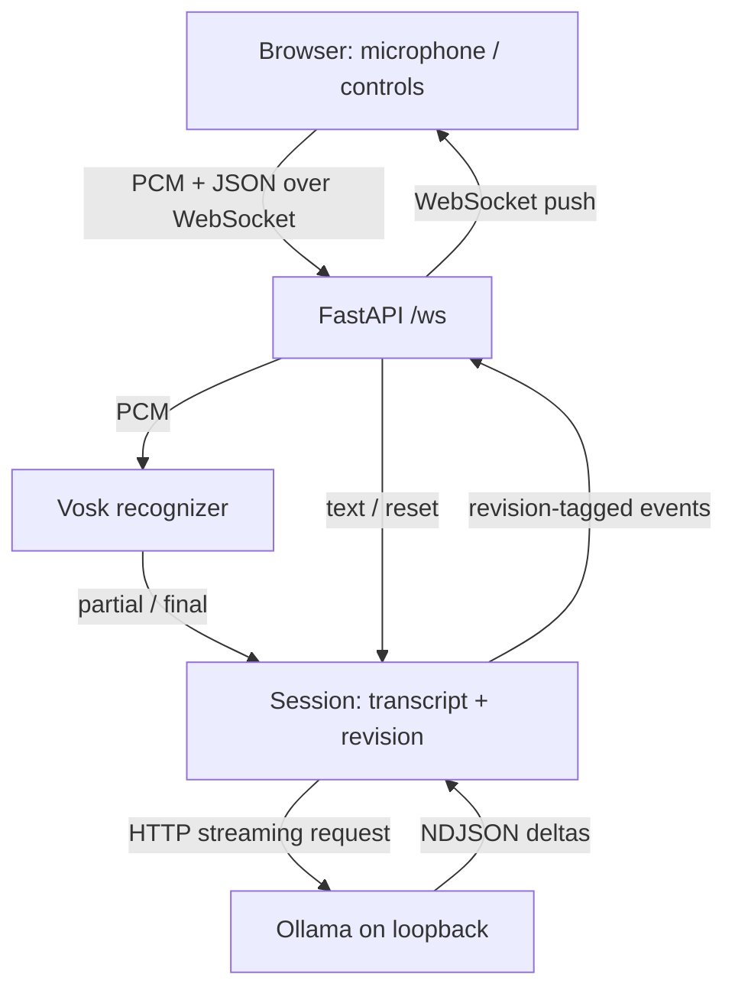
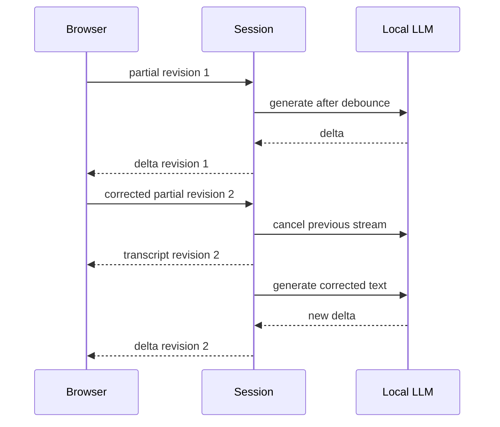

# ローカル構成と処理の流れ

`app.py` が接続と入力の検証、`session.py` が文字起こしと生成の寿命、`providers.py` がVosk/Ollamaとの通信を担当します。Voskモデルはプロセスで共有し、recognizerは接続ごとに作ります。CPUでの音声認識は `asyncio.to_thread` に移し、同じrecognizerを順番に呼びます。

## 部分結果はappendしない

| イベント | 確定済み | 途中の文 |
|---|---|---|
| partial: 高温 | 空 | 高温 |
| partial: 交通 | 空 | 交通 |
| final: 交通です | 交通です | 空 |
| partial: 次に | 交通です | 次に |

「高温交通」と連結すると誤りが残ります。確定済みの文と、置き換え可能な現在の部分結果を分けて保持します。partialが空に修正された場合も古い部分結果を消します。Voskの無音区切りを1セグメントとし、`stop_audio` で最後の未確定音声をflushします。確定文は末尾2000文字、入力も1メッセージ2000文字までです。

## キャンセルと順序

入力が変わるとrevisionを増やし、以前のtaskをcancelして終了を待ちます。HTTPXのstream contextも閉じます。サーバーとブラウザが両方revisionを確認し、新しい文字起こしの後に古い生成断片を混ぜません。ブラウザは旧回答を消して「生成待ち」を表示します。接続が切れると生成taskを取り消し、認識セッションを破棄します。

キャンセルはローカルHTTPストリームを閉じる処理です。推論エンジンの内部計算が同じ瞬間に止まることや、GPU資源が即座に解放されることまでは保証しません。

## 遅延とbackpressure

表示するTTFTは「当該文字起こしをサーバーが受け付けてから最初の生成文字を送るまで」です。debounceとモデルロードを含み、音声取得・音声認識・画面までのネットワーク遅延を含みません。デモの値はLLM性能ではありません。

- 変更のないpartialは無視。変わったpartialは350ms debounce、finalは即時。
- 音声は最大4096サンプル。ブラウザは `audio_ack` で未処理数を追い、4チャンクを超える場合は音声を停止して通知する。
- WebSocketの送信バッファが64KiBを超えた場合も停止する。音声を黙って間引かない。
- サーバーの1音声メッセージは32KiBまで。WebSocket transportにも32KiBの上限を指定。
- 生成は1接続1task、最大120秒・8000文字。画面のイベントログは80件。

高速に変わり続けるpartialではdebounceにより生成が遅れます。改善案は、安定したprefixだけを使う、一定間隔で最新snapshotを選ぶ、生成が進んでいる間は最新候補1件だけを保持することです。この教材はキャンセルと正しい置き換えを見やすくするため、単純なdebounceを採用しています。

## AWS構成で補う処理

図の矢印はデータの流れです。TranscribeがpartialごとにLambdaを自動起動する構成を、このサンプルが保証するわけではありません。AWS実装では音声ストリームのconsumer、生成の起動方法、接続IDの保存・削除、送信処理を設計します。

[Transcribeのpartial](https://docs.aws.amazon.com/transcribe/latest/dg/streaming-partial-results.html)には `IsPartial` があり、安定化を有効にすると `Stable` により変化しにくい項目を識別できます。Voskのpartial全体の置き換えと意味が完全に同じではありません。

[BedrockのストリーミングAPI](https://docs.aws.amazon.com/bedrock/latest/APIReference/API_runtime_InvokeModelWithResponseStream.html)を読む処理と、[API Gateway WebSocketへの送信](https://docs.aws.amazon.com/apigateway/latest/developerguide/apigateway-websocket-api-overview.html)は別です。通常のLambda returnだけでは、生成の断片が既存接続に逐次pushされません。AWSではconnection IDに対応するManagement APIへの送信と、切断済み接続の掃除が必要です。

## なぜ他のパターンでは待ち時間が増えるか

| パターン | 影響 |
|---|---|
| 最終文字起こし → 完全なLLM応答 | 発言と生成の完了をそれぞれ待つ |
| REST polling | 次のpollまで表示が遅れる。双方向ストリームではない |
| ファイル保存 → バッチ文字起こし | ライブ表示より事後処理に向く |
| 部分文字起こし → stream → WebSocket | 途中から表示できるが、修正・キャンセル・負荷制御が必要 |
