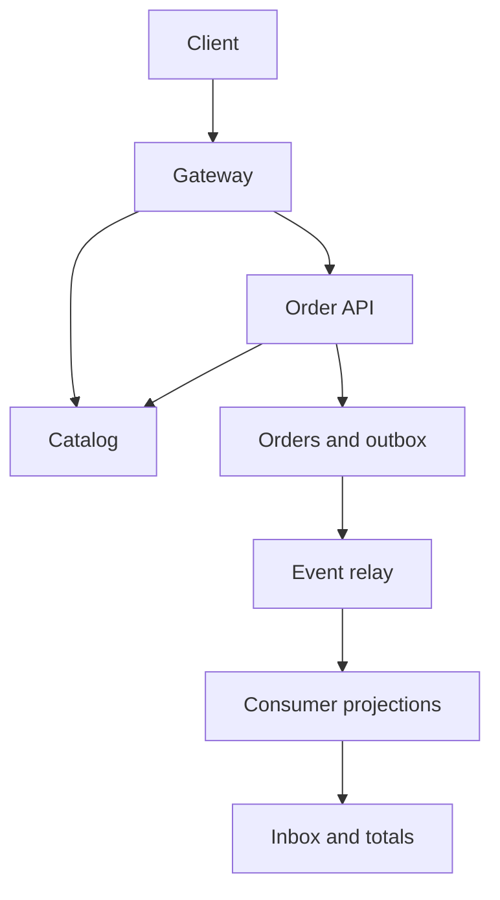
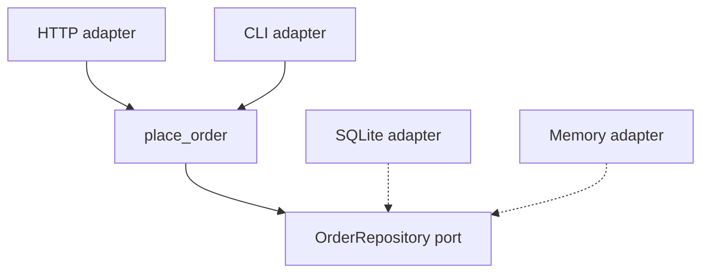
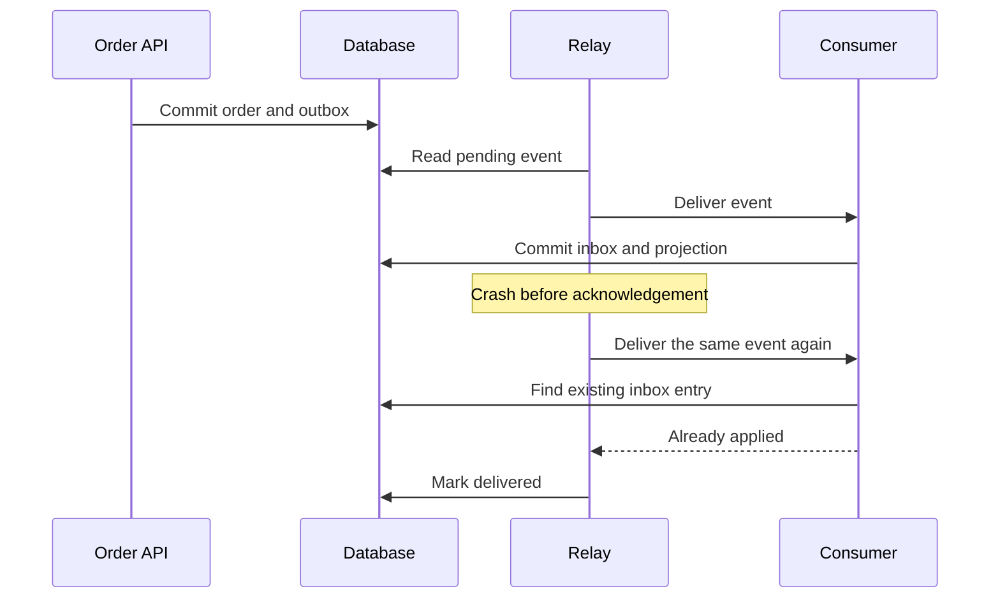

# Design an Idempotent Order Service

## 30-sec summary

I would start with an order API and a transactional database. The client supplies an idempotency key, and the server stores the request identity with the accepted order. The order and an outbox event commit together. Consumers use an inbox to prevent duplicate effects. I would separate services when ownership or scaling needs justify it.

## Clarifying questions

- Do we only record orders, or also reserve stock and charge payments?
- What are peak requests per second and the latency target?
- Must a retry return the original price after a catalog change?
- How stale may the catalog and analytics be?
- Are there tenant boundaries, regional restrictions, or recovery targets?
- How long must the idempotency key remain valid?

## Requirements

The implemented scope records orders, lists them, and safely replays accepted requests. Prices use integer yen. An accepted order must have one local outbox row. Duplicate delivery must not increase the same consumer projection twice.

The lab has no payment gateway, stock reservation, authentication, or global replication. A production schema would normally use a unique `(tenant_id, idempotency_key)` constraint.

For an interview estimate, assume **100 new orders/second**, **2 KB/order**, and **30 days of hot storage**. These are illustrative assumptions, not measurements. Sustaining that rate gives 8.64 million orders/day and about 17.28 GB/day before indexes, events, replicas, and backups. Average traffic may be much lower. Use actual load and retention to select capacity.

## High-level design

Docker runs real Order, Catalog, and Gateway processes. The outbox relay and projections run in the local Python lab. The separate Kafka exercise validates broker delivery; it is not wired into the local dispatcher. This distinction makes the implemented failure boundaries explicit.

Solid arrows are use/import relationships. Dashed arrows mean implementation of the port. The domain does not import a database adapter.

## Deep dive 1

### Safe retries and price snapshots

A client may time out after the database commits. It retries with the same key and body. The server first checks whether the key was accepted. It validates the request fingerprint and returns the stored result. A different body returns 409.

For a new key, the server gets the price and creates the order. Inside `BEGIN IMMEDIATE`, it checks the key again because another request may have committed during the price lookup. The request fingerprint contains client intent: SKU and quantity. It excludes the current price. This preserves the accepted result after a price change.

The order and outbox insert share a transaction. Failure between them rolls back both. A test sends 24 concurrent retries and checks that one order and one event exist.

Production needs a retention policy. Removing an idempotency record too early can turn an old retry into a new order. Canonicalization also matters: this demo treats item order as significant and does not merge repeated SKU lines.

## Deep dive 2

### Delivery failure windows

Delivery is at least once. The local effect is idempotent because `(consumer, event_id)` is unique and the inbox insert shares a transaction with the projection update.

This does not make a remote payment or email exactly once. For payments, pass a stable provider idempotency key and reconcile unknown outcomes. For email, choose a policy for possible duplicate delivery. A production relay needs backoff, leases, dead-letter handling, and lag metrics. The current relay is single-process.

## Deep dive 3

### Failure isolation and scaling

New orders depend on Catalog. A bounded timeout returns 503 on failure; existing orders still replay locally. A cache may improve availability after the business defines the acceptable age of a price.

SQLite serializes writers. Before scaling application replicas, select a shared database and test its transaction semantics. The hash-ring lab shows key movement, not live shard migration.

During a partition, stock reservation may reject writes to avoid overselling. Product descriptions may serve stale results. CAP choices belong to specific operations. The model does not implement leader election or quorum.

Measure request rate, errors, latency distributions, saturation, pending outbox age, and consumer lag. See [Google SRE monitoring guidance](https://sre.google/sre-book/monitoring-distributed-systems/).

## Tradeoffs

| Choice | Benefit | Cost or limit |
|---|---|---|
| Modular start | Simple deployment and transactions | Less independent scaling |
| Separate catalog | Explicit ownership | Network dependency for new orders |
| Outbox | No local order/event split | Relay and retention work |
| Consumer inbox | Safe repeated local effects | Extra storage |
| Cached catalog | Lower latency and origin load | Stale data |
| SQLite | Easy local reproduction | Serialized writers |

## Failure cases

| Failure | Current behavior | Production extension |
|---|---|---|
| Response lost | Return original order on retry | Tenant scoping and key retention |
| Failure before outbox insert | Roll back | Backup and recovery tests |
| Relay crashes after consume | Ignore repeated event | Relay leases and bounded retries |
| Catalog unavailable | New request gets 503; accepted key replays | Defined stale-price policy |
| Unsupported event version | Reject | Compatibility and dead-letter policy |
| K8s pod replaced | emptyDir data is lost | Durable shared database |
| Broker replaced | Fixture log data is lost | Replication and durable volumes |
| Payment result unknown | Outside current implementation | Provider idempotency and reconciliation |

## 2-min English answer

I would first confirm whether we only record orders or also handle payment and stock. I would confirm traffic, latency, retention, and consistency requirements.

I would start with an order API and a transactional database. The client sends a stable idempotency key. The server stores that key with a fingerprint of the request and the accepted result. A retry returns the original order. A changed body returns a conflict. This also preserves the original price after a catalog update.

I would write the order and an outbox event in one transaction. A relay sends the event to consumers. Delivery may happen more than once, so each consumer stores the event ID with its local update. A duplicate then has no second effect. This guarantee applies to the local transaction. External payments need their own idempotency key and reconciliation.

For product reads, a cache can reduce latency and origin load. I would define allowed staleness before using cached prices for an order. A catalog timeout should not block a retry of an already accepted order.

I would monitor latency, errors, saturation, and event lag. I would test crashes before commit and after consumer processing. I would split services when scale or ownership gives a clear reason. Before adding replicas, I would replace local storage with a database that supports the required concurrency and recovery guarantees.
